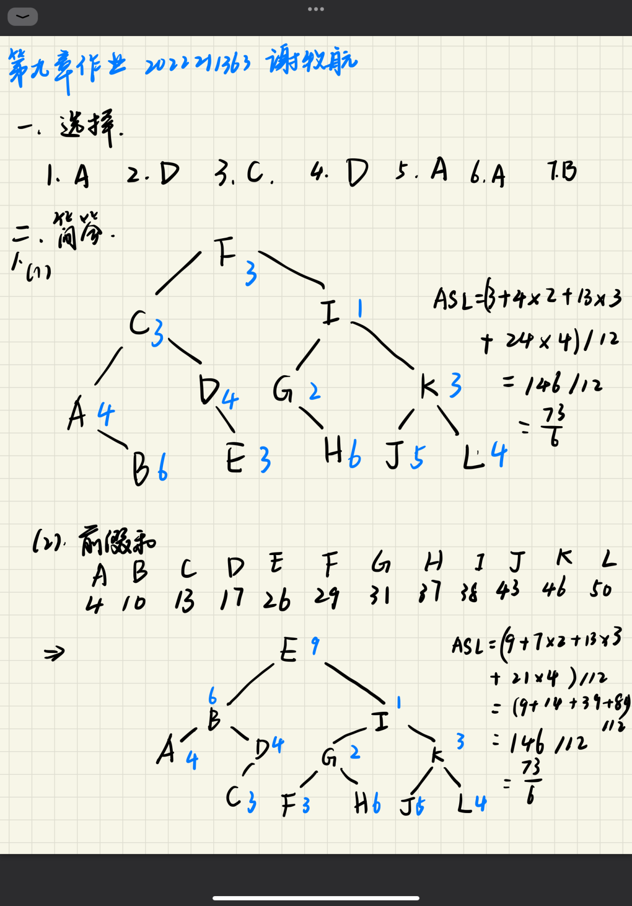
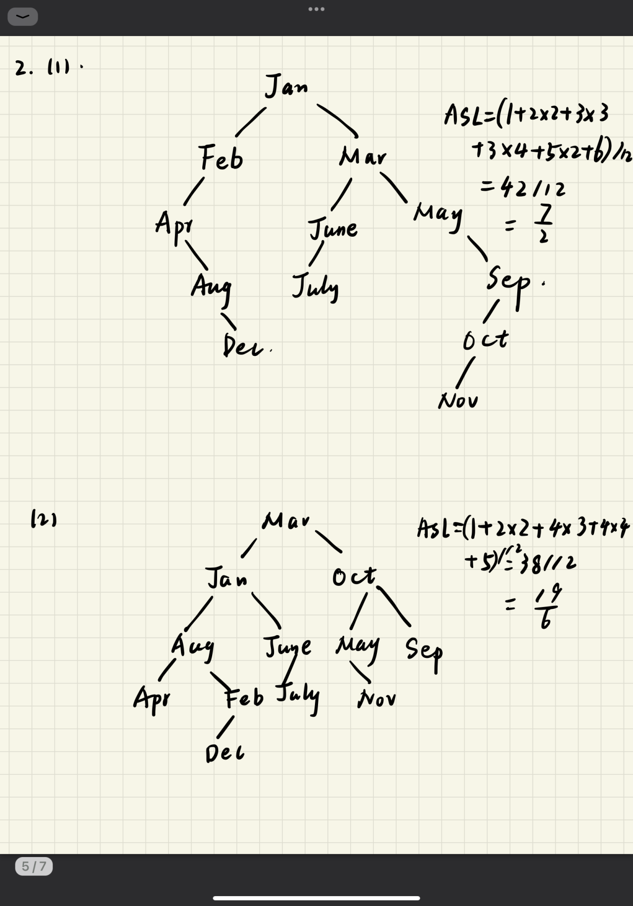
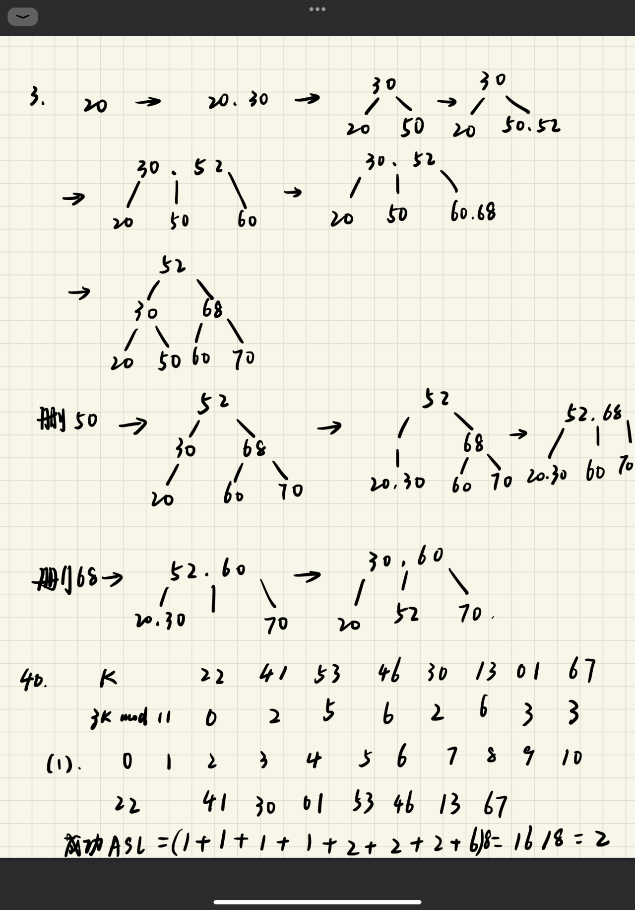
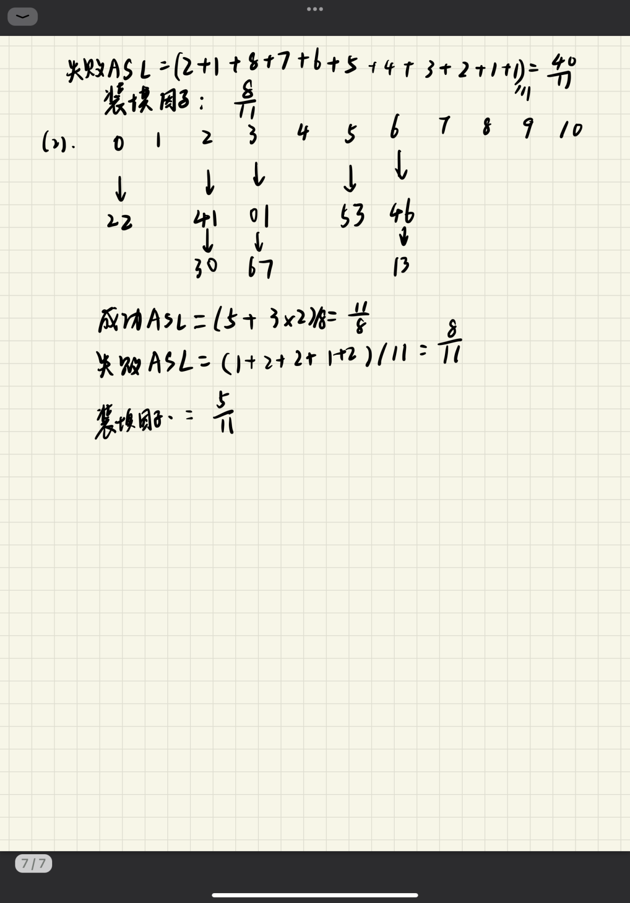

# 第九章作业

2022211363 谢牧航






三、算法题

1. 

```cpp
int binary_search_last_not_greater(int arr[], int size, int value) {
    int left = 0;
    int right = size - 1;
    int result = -1;
    while (left <= right) {
        int mid = left + (right - left) / 2;

        if (arr[mid] <= value) {
            result = mid; // 更新结果为当前中点，但继续在右侧查找可能的更大值
            left = mid + 1;
        } else {
            right = mid - 1;
        }
    }
    return result;
}
```

2. 

```cpp
void insert_in_order(int arr[], int* size, int x) {
    int left = 0;
    int right = *size - 1;
    int pos = *size; // 默认插入位置是数组末尾

    while (left <= right) {
        int mid = left + (right - left) / 2;
        if (arr[mid] < x) {
            left = mid + 1;
        } else {
            pos = mid; // 更新插入位置为中点
            right = mid - 1;
        }
    }

    // 将元素从 pos 位置开始向后移动
    for (int i = *size; i > pos; --i) {
        arr[i] = arr[i - 1];
    }

    arr[pos] = x; // 在正确位置插入元素 x
    (*size)++; // 增加数组的大小
}
```

3. 

```cpp
void print_if_not_less_than_x(TreeNode *root, int x) {
    if (root == NULL) {
        return;
    }
    // 先递归访问右子树
    print_if_not_less_than_x(root->right, x);
    // 如果当前节点的值小于x，则不需要再访问左子树
    if (root->val < x) {
        return;
    }
    // 输出当前节点的值
    printf("%d ", root->val);
    // 最后递归访问左子树
    print_if_not_less_than_x(root->left, x);
}
