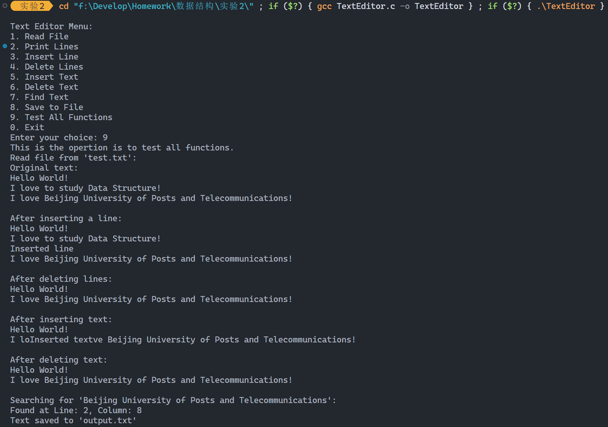
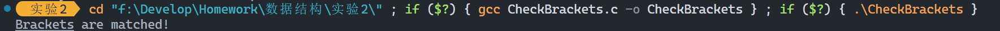

[TOC]

# 实验二：线性表-栈-串综合应用实验

| 班级 | 学号 | 姓名 | 学院 |
| :--: | :--: | :--: | :--: |
| 2022211313 | 2022211363 | 谢牧航 | 计算机学院|

## 一、实验目的

1. 熟悉线性表的实现与应用
2. 熟悉栈的实现与应用
3. 熟悉串的实现与应用
4. 培养根据实际问题合理选择数据结构的能力
5. 学习自己查找相关资料以解决实际问题的能力

## 二、实验环境

操作系统：Windows 11

C++编译器：MinGW gcc version 8.1.0 (x86_64-posix-seh-rev0, Built by MinGW-W64 project)

编译指令：`g++ -o main main.cpp`

## 三、实验内容和步骤

### 简单命令行程序

#### 定义数据结构

为了方便行的插入删除和文本的插入删除，我使用链表这个数据结构来储存数据。具体来说，行之间的关系形成一个链表，每一行的内容也是一个链表，每一个字符都是一个节点。这样，我们就可以方便地进行插入删除操作。

```cpp
// 定义字符节点
typedef struct CharNode {
    char ch;
    struct CharNode* next;
} CharNode;

// 定义行节点
typedef struct LineNode {
    CharNode* chars;  // 指向行中第一个字符的指针
    struct LineNode* next;  // 指向下一行的指针
} LineNode;
```

#### 功能一：读取文件

函数 `LineNode* readFile(char* filename)`，表示从文件 `filename` 中读取数据，并返回一个链表头节点。

使用 `fopen` 命令读取文件。

```cpp
LineNode* readFile(char* filename) {
    FILE* fp = fopen(filename, "r");
    if (fp == NULL) {
        printf("Error: Cannot open file!\n");
        return NULL;
    }

    LineNode* head = NULL;
    LineNode* currentLine = NULL;
    CharNode* currentChar = NULL;
    char ch;
    while ((ch = fgetc(fp)) != EOF) {
        if (head == NULL) {
            head = (LineNode*)malloc(sizeof(LineNode));
            head->chars = NULL;
            head->next = NULL;
            currentLine = head;
        }
        if (currentLine->chars == NULL) {
            currentLine->chars = (CharNode*)malloc(sizeof(CharNode));
            currentLine->chars->ch = ch;
            currentLine->chars->next = NULL;
            currentChar = currentLine->chars;
        } else {
            currentChar->next = (CharNode*)malloc(sizeof(CharNode));
            currentChar = currentChar->next;
            currentChar->ch = ch;
            currentChar->next = NULL;
        }
        if (ch == '\n') {
            currentLine->next = (LineNode*)malloc(sizeof(LineNode));
            currentLine = currentLine->next;
            currentLine->chars = NULL;
            currentLine->next = NULL;
        }
    }
    
    fclose(fp);
    return head;
}
```

#### 功能二：输出指定范围的行

函数 `void printLines(LineNode* head, int start, int end)`，表示输出链表 `head` 中从第 `start` 行到第 `end` 行的内容。

```cpp
void printLines(LineNode* head, int start, int end) {
    LineNode* currentLine = head;
    int lineNum = 1;
    while (currentLine != NULL && lineNum <= end) {
        if (lineNum >= start) {
            CharNode* currentChar = currentLine->chars;
            while (currentChar != NULL) {
                printf("%c", currentChar->ch);
                currentChar = currentChar->next;
            }
            if (currentLine->chars == NULL) {
                printf("\n");
            }
        }
        currentLine = currentLine->next;
        lineNum++;
    }
}
```

#### 功能三：插入行

函数 `LineNode* insertLine(LineNode* head, int lineNum, char* text)` 表示在链表 `head` 的第 `lineNum` 行之前插入一行内容为 `text` 的行，并返回链表头节点。插入行后面的行号都会加一。

```cpp
LineNode* insertLine(LineNode* head, int lineNum, char* text) {
    LineNode* newLine = (LineNode*)malloc(sizeof(LineNode));
    newLine->chars = NULL;
    newLine->next = NULL;

    CharNode* currentChar = NULL;
    for (int i = 0; text[i] != '\0'; i++) {
        if (newLine->chars == NULL) {
            newLine->chars = (CharNode*)malloc(sizeof(CharNode));
            newLine->chars->ch = text[i];
            newLine->chars->next = NULL;
            currentChar = newLine->chars;
        } else {
            currentChar->next = (CharNode*)malloc(sizeof(CharNode));
            currentChar = currentChar->next;
            currentChar->ch = text[i];
            currentChar->next = NULL;
        }
    }

    // 如果结尾不是回车添加回车
    // 由于我自己写的字符串读取函数会忽略最后的回车，所以这里需要手动添加回车
    if (currentChar != NULL && currentChar->ch != '\n') {
        currentChar->next = (CharNode*)malloc(sizeof(CharNode));
        currentChar = currentChar->next;
        currentChar->ch = '\n';
        currentChar->next = NULL;
    }

    if (lineNum == 1) {
        newLine->next = head;
        return newLine;
    }

    LineNode* currentLine = head;
    for (int i = 1; i < lineNum - 1 && currentLine != NULL; i++) {
        currentLine = currentLine->next;
    }
    if (currentLine == NULL) {
        printf("Error: Line number out of range!\n");
        free(newLine);
        return head;
    }
    newLine->next = currentLine->next;
    currentLine->next = newLine;
    return head;
}
```

#### 功能四：删除行

函数 `LineNode* deleteLines(LineNode* head, int start, int end)`，表示删除链表 `head` 中从第 `start` 行到第 `end` 行的内容，并返回链表头节点。删除行后面的行号都会减一。

```cpp
LineNode* deleteLines(LineNode* head, int start, int end) {
    LineNode* currentLine = head;
    LineNode* prevLine = NULL;
    int lineNum = 1;
    while (currentLine != NULL && lineNum <= end) {
        if (lineNum >= start) {
            LineNode* temp = currentLine;
            currentLine = currentLine->next;
            if (prevLine == NULL) {
                head = currentLine;
            } else {
                prevLine->next = currentLine;
            }
            free(temp);
        } else {
            prevLine = currentLine;
            currentLine = currentLine->next;
        }
        lineNum++;
    }
    return head;
}
```

#### 功能五：行内插入文本

函数 `void insertText(LineNode* head, int lineNum, int colNum, char* text)`，表示在链表 `head` 的第 `lineNum` 行第 `colNum` 列作为开头插入文本 `text`。

```cpp
void insertText(LineNode* head, int lineNum, int colNum, char* text) {
    LineNode* currentLine = head;
    for (int i = 1; i < lineNum && currentLine != NULL; i++) {
        currentLine = currentLine->next;
    }
    if (currentLine == NULL) {
        printf("Error: Line number out of range!\n");
        return;
    }

    CharNode* currentChar = currentLine->chars;
    CharNode* prevChar = NULL;
    for (int i = 1; i < colNum && currentChar != NULL; i++) {
        prevChar = currentChar;
        currentChar = currentChar->next;
    }
    if (currentChar == NULL && colNum != 1) {
        printf("Error: Column number out of range!\n");
        return;
    }

    for (int i = 0; text[i] != '\0'; i++) {
        CharNode* newChar = (CharNode*)malloc(sizeof(CharNode));
        newChar->ch = text[i];
        newChar->next = currentChar;
        if (prevChar == NULL) {
            currentLine->chars = newChar;
        } else {
            prevChar->next = newChar;
        }
        prevChar = newChar;
    }
}
```

#### 功能六：行内删除文本

函数 `void deleteText(LineNode* head, int lineNum, int startCol, int endCol)`，表示删除在链表 `head` 的第 `lineNum` 行第 `startCol` 列到第 `endCol` 列之间的文本。

```cpp
void deleteText(LineNode* head, int lineNum, int startCol, int endCol) {
    LineNode* currentLine = head;
    for (int i = 1; i < lineNum && currentLine != NULL; i++) {
        currentLine = currentLine->next;
    }
    if (currentLine == NULL) {
        printf("Error: Line number out of range!\n");
        return;
    }

    CharNode* currentChar = currentLine->chars;
    CharNode* prevChar = NULL;
    for (int i = 1; i < startCol && currentChar != NULL; i++) {
        prevChar = currentChar;
        currentChar = currentChar->next;
    }
    if (currentChar == NULL) {
        printf("Error: Start column number out of range!\n");
        return;
    }

    for (int i = startCol; i <= endCol && currentChar != NULL; i++) {
        CharNode* temp = currentChar;
        currentChar = currentChar->next;
        free(temp);
        if (prevChar == NULL) {
            currentLine->chars = currentChar;
        } else {
            prevChar->next = currentChar;
        }
    }
    if (endCol > startCol && currentChar == NULL) {
        printf("Error: End column number out of range!\n");
    }
}
```

#### 功能七：查找文本

函数 `void findText(LineNode* head, int startLine, char* pattern)`，表示在链表 `head` 中从第 `startLine` 行开始查找文本 `pattern`，并输出第一次匹配的行号和列号。

这里使用了 KMP 算法来进行字符串匹配。`computeNextArray` 函数是用来计算 `pattern` 的 next 数组的。

```cpp
void findText(LineNode* head, int startLine, char* pattern) {
    int m = strlen(pattern);
    int* next = (int*)malloc(m * sizeof(int));
    computeNextArray(pattern, next);

    LineNode* currentLine = head;
    for (int i = 1; i < startLine && currentLine != NULL; i++) {
        currentLine = currentLine->next;
    }
    if (currentLine == NULL) {
        printf("Error: Start line number out of range!\n");
        free(next);
        return;
    }

    int lineNum = startLine;
    int colNum = 1;
    CharNode* currentChar = currentLine->chars;
    int j = -1;
    while (currentLine != NULL) {
        while (currentChar != NULL) {
            while (j >= 0 && currentChar->ch != pattern[j + 1]) {
                j = next[j];
            }
            if (currentChar->ch == pattern[j + 1]) {
                j++;
            }
            if (j == m - 1) {
                printf("Found at Line: %d, Column: %d\n", lineNum, colNum - m + 1);
                free(next);
                return;
            }
            currentChar = currentChar->next;
            colNum++;
        }
        currentLine = currentLine->next;
        lineNum++;
        if (currentLine != NULL) {
            currentChar = currentLine->chars;
            colNum = 1;
        }
    }
    printf("Not found!\n");
    free(next);
}
```

#### 功能八：保存到文件

函数 `void saveToFile(LineNode* head, char* filename)`，表示将文本编辑器中的内容保存到文件 `filename` 中。

```cpp
void saveToFile(LineNode* head, char* filename) {
    FILE* fp = fopen(filename, "w");
    if (fp == NULL) {
        printf("Error: Cannot open file!\n");
        return;
    }

    LineNode* currentLine = head;
    while (currentLine != NULL) {
        CharNode* currentChar = currentLine->chars;
        while (currentChar != NULL) {
            fputc(currentChar->ch, fp);
            currentChar = currentChar->next;
        }
        currentLine = currentLine->next;
    }

    fclose(fp);
}
```

更多函数和功能，请查看源代码 `TextEditor.c`。

#### 功能测试

运行测试函数，得到运行结果如下。

注：`test.txt` 文件内容为

```txt
Hello World!
I love to study Data Structure!
I love Beijing University of Posts and Telecommunications!
```



### 检查括号匹配

`CheckBrackets.c` 使用栈这个数据结构来匹配 `[]`、`()` 和 `{}` 这三种括号。用这个程序可以检查一个 `TextEditor.c` 中的括号是否匹配。

当我们遍历源代码或表达式的字符时，每当遇到一个开括号（`(`, `{`, 或 `[`），我们就将其压入栈中。这表示我们期待在未来的某个时刻看到与之匹配的闭括号。

当我们遇到一个闭括号（`)`, `}`, 或 `]`）时，我们检查栈顶的元素：
1. 如果栈是空的，这意味着没有与当前闭括号匹配的开括号，所以括号不匹配。
2. 如果栈不为空，我们弹出栈顶元素，并检查它是否与当前的闭括号匹配：
   - 如果它们匹配，我们继续处理下一个字符。
   - 如果它们不匹配，这意味着括号不匹配。

当我们遍历完所有的字符后，如果栈是空的，这意味着所有的开括号都找到了匹配的闭括号，所以括号匹配。如果栈不为空，这意味着有一些开括号没有找到匹配的闭括号，所以括号不匹配。

所以我们可以写出如下的检查函数：

```cpp
int checkBrackets(const char* filename) {
    FILE* file = fopen(filename, "r");
    if (!file) {
        fprintf(stderr, "Error opening file: %s\n", filename);
        return -1;
    }

    Stack* stack = createStack(100);
    char ch;
    while ((ch = fgetc(file)) != EOF) {
        if (ch == '{' || ch == '(' || ch == '[') {
            push(stack, ch);
        } else if (ch == '}' || ch == ')' || ch == ']') {
            if (isEmpty(stack) || !isMatchingPair(pop(stack), ch)) {
                fprintf(stderr, "Unmatched closing bracket: %c\n", ch);
                fclose(file);
                free(stack->array);
                free(stack);
                return -1;
            }
        }
    }

    if (!isEmpty(stack)) {
        fprintf(stderr, "Unmatched opening brackets\n");
        fclose(file);
        free(stack->array);
        free(stack);
        return -1;
    }

    fclose(file);
    free(stack->array);
    free(stack);
    printf("Brackets are matched!\n");
    return 0;
}
```

其他源代码请查看 `CheckBrackets.c`。

#### 功能测试

运行函数 `checkBrackets("TextEditor.c")`，结果如下。



## 四、实验分析和总结

### 实验一：文本编辑器

#### 工作思路与设想
在这个实验中，我的目标是实现一个基本的文本编辑器，能够对文本文件进行一系列的编辑操作。我选择了用C语言来实现。

数据结构的设计是这个实验的核心部分。我选择了双层链表的结构：外层链表的每个节点代表文本的一行，而每个节点内部又包含一个链表，代表这一行中的每个字符。这样的设计使得插入和删除操作相对高效，特别是对于行的操作。

#### 实现的功能与效果
实现的文本编辑器具有以下功能：
1. 读取并存储文本文件
2. 输出指定范围的文本行
3. 插入和删除文本行
4. 在行内插入和删除文本
5. 查找文本
6. 保存文本到文件

这些功能的实现效果良好，能够满足基本的文本编辑需求。

#### 时间复杂度分析
- 读取文件：\(O(n \cdot m)\)，其中\(n\)是文件的行数，\(m\)是每行的平均字符数。
- 输出文本行：\(O(n \cdot m)\)，其中\(n\)是要输出的行数，\(m\)是每行的平均字符数。
- 插入和删除文本行：\(O(n)\)，其中\(n\)是文件的行数。
- 在行内插入和删除文本：\(O(m)\)，其中\(m\)是行的长度。
- 查找文本：使用KMP算法，时间复杂度为\(O(n \cdot m + s)\)，其中\(n\)是文件的行数，\(m\)是每行的平均字符数，\(s\)是要查找的文本的长度。
- 保存文本到文件：\(O(n \cdot m)\)，其中\(n\)是文件的行数，\(m\)是每行的平均字符数。

#### 心得与困难
通过这个实验，我加深了对链表和其它数据结构的理解，并学会了如何在实际问题中应用它们。我也认识到了在设计数据结构时考虑时间复杂度的重要性。

在实验过程中，最开始使用 `scanf` 输入文本时发现，`scanf` 会忽略空格和换行符，所以我改用自己写的 `readString` 函数来读取文本。这个函数核心函数就是 `fgets` 函数。为了忽略上一条命令行的回车，我使用了 `while` 循环来清除缓存区。

### 实验二：括号匹配检查器

#### 工作思路与设想
在这个实验中，我需要检查C语言源代码文件中的括号是否匹配。我的设想是读取文件的每个字符，使用栈来跟踪未匹配的开括号，当遇到闭括号时检查栈顶的开括号是否匹配。

#### 实现的功能与效果
实现的括号匹配检查器能够准确地检测出源代码文件中括号是否匹配，并在发现不匹配的括号时给出错误提示。

#### 时间复杂度分析
- 检查括号匹配：\(O(n)\)，其中\(n\)是文件的字符数。

#### 心得与困难
通过这个实验，我学到了如何使用栈来解决实际问题，并加深了对栈数据结构的理解。我还学会了如何读取文件并逐个处理其字符。

### 总结
这两个实验让我更加熟悉了C语言和常用的数据结构，也让我认识到了在实际编程中考虑时间复杂度的重要性。虽然在实验过程中遇到了一些困难，但通过查阅资料和不断尝试，我最终克服了这些困难，完成了实验目标。这对于提高我的编程能力和解决问题的能力有很大帮助。