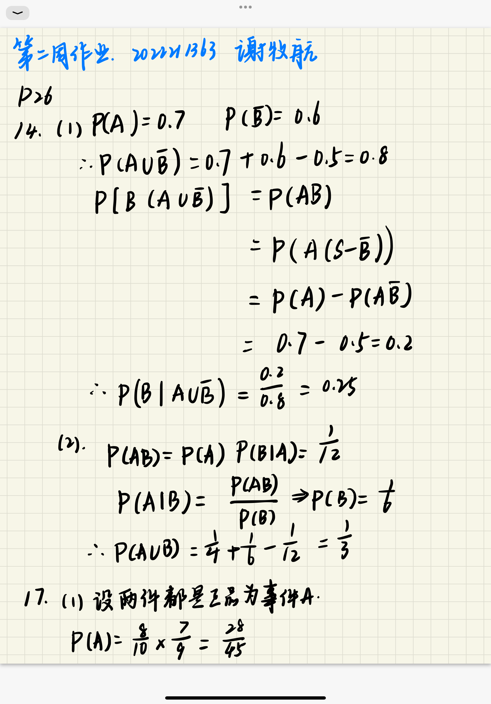
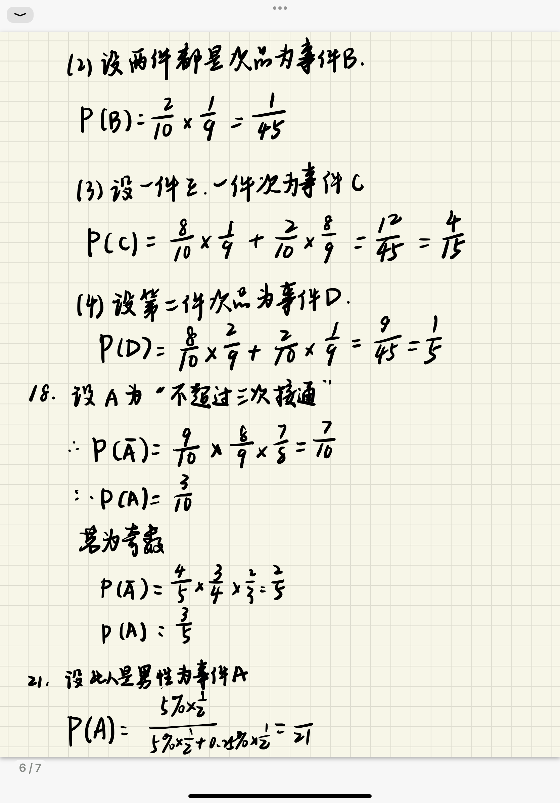

---
puppeteer:
  timeout: 1000
---

[TOC]

# 第二周作业

2022211363 谢牧航

## 习题

<div align = center>

</div>

<div align = center>

</div>

## 条件概率性质证明

### 有限可加性

对于任意的不相交事件 $A_1, A_2, \ldots, A_n$，证明：

\[
P(A_1 \cup A_2 \cup \ldots \cup A_n | B) = P(A_1|B) + P(A_2|B) + \ldots + P(A_n|B)
\]

则

\[
P(A_1 \cup A_2 \cup \ldots \cup A_n | B) = \frac{P((A_1 \cup A_2 \cup \ldots \cup A_n) \cap B)}{P(B)}
\]

因为 $A_1, A_2, \ldots, A_n$ 是不相交的，所以：

\[
P((A_1 \cup A_2 \cup \ldots \cup A_n) \cap B) = P(A_1 \cap B) + P(A_2 \cap B) + \ldots + P(A_n \cap B)
\]

回到条件概率：

\[
P(A_1 \cup A_2 \cup \ldots \cup A_n | B) = \frac{P(A_1 \cap B) + P(A_2 \cap B) + \ldots + P(A_n \cap B)}{P(B)}
\]

根据条件概率的定义，这可以简化为：

\[
P(A_1 \cup A_2 \cup \ldots \cup A_n | B) = P(A_1|B) + P(A_2|B) + \ldots + P(A_n|B)
\]

证明完成。

### 加法公式

要证明条件概率的加法公式，即：

\[
P(B_1 \cup B_2 | A) = P(B_1|A) + P(B_2|A) - P(B_1 \cap B_2 | A)
\]

1. 表达 \(P(B_1 \cup B_2 | A)\)

\[
P(B_1 \cup B_2 | A) = \frac{P(A \cap (B_1 \cup B_2))}{P(A)}
\]

2. 分解 \(A \cap (B_1 \cup B_2)\)

\[
A \cap (B_1 \cup B_2) = (A \cap B_1) \cup (A \cap B_2)
\]

3. 应用概率的加法公式

\[
P(A \cap (B_1 \cup B_2)) = P(A \cap B_1) + P(A \cap B_2) - P((A \cap B_1) \cap (A \cap B_2))
\]

\[
= P(A \cap B_1) + P(A \cap B_2) - P(A \cap B_1 \cap B_2)
\]

4. 回到条件概率

\[
P(B_1 \cup B_2 | A) = \frac{P(A \cap B_1) + P(A \cap B_2) - P(A \cap B_1 \cap B_2)}{P(A)}
\]

\[
= \frac{P(A \cap B_1)}{P(A)} + \frac{P(A \cap B_2)}{P(A)} - \frac{P(A \cap B_1 \cap B_2)}{P(A)}
\]

\[
= P(B_1|A) + P(B_2|A) - P(B_1 \cap B_2 | A)
\]

证明完成。

## 系统可靠性

子系统 $A_3, A_4$ 的可靠性较低，可以考虑将这两个子系统并联以提高他们的组合可靠性。

例如，$A_3$ 和 $A_4$ 并联后的可靠性是：

$$R_{A_3A_4} = 1 - (1 - 0.7) \times (1 - 0.75) = 1 - 0.3 \times 0.25 = 1 - 0.075 = 0.925$$

然后，可以将这个并联组合（$R_{A_3A_4}=0.925$）与其他子系统（$A_1, A_2, A_5$）进行串联：

$$R_{total} = 0.925 \times 0.95 \times 0.95 \times 0.95 \approx 0.795$$

这样，整个系统的可靠性就达到了 $0.795$，满足了不低于 $0.78$ 的要求。

## 生日问题

生日问题是一个著名的概率论问题，用于考察在一个大小为 $n$ 的随机样本中，至少有两个人生日相同的概率。

### Python 仿真模拟

我将使用 Python 仿真模拟来绘制频率变化曲线。

1. 对于每一个 $n = k$（$k = 2, 3, \ldots,1 00$），我们会进行 100 次随机模拟。
2. 在每次模拟中，我们会随机生成 $n$ 个介于 1 和 365 之间的整数，用以代表 $n$ 个人的生日。
3. 我们将检查是否存在至少一对相同的生日。
4. 记录每次模拟结果，统计出现生日相同的频率。
5. 绘制 $n = k$ 和生日相同的累积频率之间的关系图。

```python
import random
import matplotlib.pyplot as plt

# 初始化变量
cumulative_frequencies = []  # 用于存储每个n=k时的累积频率
trials = 100  # 每个n=k的试验次数

# 进行模拟
for n in range(2, 101):  # n=k从2到100
    same_birthday_count = 0  # 初始化相同生日的计数器
    
    for _ in range(trials):  # 进行100次试验
        birthdays = [random.randint(1, 365) for _ in range(n)]  # 随机生成n个生日
        if len(set(birthdays)) < len(birthdays):  # 检查是否有相同的生日
            same_birthday_count += 1  # 如果有，计数器加1
            
    frequency = same_birthday_count / trials  # 计算频率
    cumulative_frequencies.append(frequency)  # 添加到累积频率列表

# 绘制图像
plt.figure(figsize=(10, 6))
plt.plot(range(2, 101), cumulative_frequencies, marker='o')
plt.xlabel('Number of People (n)')
plt.ylabel('Frequency of Same Birthdays')
plt.title('Frequency of Same Birthdays vs Number of People')
plt.grid(True)
plt.show()
```

使用 matplotlib 绘制出的图像如下：


以上是 100 次试验中出现生日相同的累积频率变化曲线。横坐标表示人数 $n$（从 2 到 100），纵坐标表示出现至少一对生日相同的频率。

从图中可以明显看出，随着人数 $n$ 的增加，出现至少一对生日相同的频率也逐渐增加。这与生日问题的理论预测是一致的。

在人数达到 23 人以上时， 至少两人生日相同的频率已大于 $50\%$。在人数达到 60 人以上时， 至少两人生日相同的频率已大于 $99\%$。

### 理论计算

设 $k$ 个人生日互不相同为事件 $A$, 则事件 $A$ 的概率为

$$P(A)=\prod_{i=0}^{k-1}\frac{n-i}{n}$$

至少有两个人生日相同的概率为 $P(\overline A)=1-P(A)$。根据题意可知 $P(\overline A)\ge\cfrac{1}{2}$, 那么就有

$$P(A)=\prod_{i=0}^{k-1}\frac{n-i}{n} \le \frac{1}{2}$$

由不等式 $1+x\le \mathrm{e}^x$ 可得

$$P(A) \le \prod_{i=1}^{k-1}\exp\left({-\frac{i}{n}}\right)=\exp \left({-\frac{k(k-1)}{2n}}\right)$$

因此

$$\exp\left({-\dfrac{k(k-1)}{2n}}\right) \le \frac{1}{2}\implies P(A) \le \frac{1}{2}$$

将 $n=365$ 代入，解得 $k\geq 23$。所以一个房间中至少 $23$ 人，使其中两个人生日相同的概率达到 $50\%$；当 $k>56$，$n=365$ 时，出现两个人同一天生日的概率将大于 $99\%$。

### 应用

Pollard Rho 算法是一种用于找出一个合数 $N$ 的非平凡因子（即既不是 $1$ 也不是 $N$ 自身）的有效算法。这个算法使用一个随机选择的多项式函数 $f(x)$ 和两个初始点 $x_1$ 和 $x_2$。然后，它迭代地应用这个函数，并检查是否在某一点找到了合适的因子。

在 Pollard Rho 算法中，我们关心的是何时会有两个不同的 $x$ 值（在模 $N$ 下）满足 $f(x_1)\equiv f(x_2)\pmod{ N}$。这样的话，$f(x_1)-f(x_2)$ 可能是 $N$ 的一个非平凡因子。

这里的“碰撞” $f(x_1)\equiv f(x_2)\pmod{ N}$ 类似于生日问题中至少两个人生日相同的情况。在生日问题中，我们知道，即使在相对小的人数 $n$ 下，至少有两个人生日相同的概率也会很高。同样，在 Pollard's Rho 算法中，即使在较小的迭代次数下，也有很高的概率找到这样一个碰撞点。实际上根据生日问题可知序列中不同值的个数小于 $\sqrt{N}$。