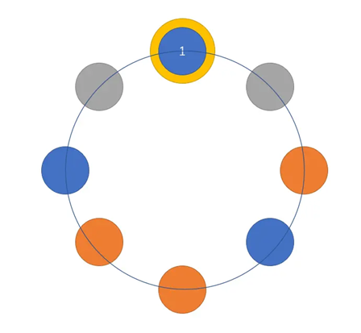

### 至少三个人生日在一天的概率

#### 理论计算

要计算至少三个人生日在一天的概率，依然可以反向思考，用总体减去每个人生日互不相同的概率，再减去恰有两人生日相同的概率即可。

假设这个班有 $n$ 个人（根据现实情况，我们只考虑 $n$ 是不超过 365 的正整数），那么每个人生日互不相同的概率为

$$P_1 = \dfrac{\prod\limits_{i = 0}^{n - 1}(365 - i)}{365^{n}}$$

而恰有两个人生日相同的概率 $P_2$ 要分有多少“生日相同2人组”。当 $n > 2$，如果有 $k$ 组，先从 $n$ 个人中选 $2 \times k$ 个人，有 $C_n^{2k}$ 种情况；再两两分组，$(2*k - 1)!!$ 种情况；之后可以视两人组为一个人，即班中有 $n-k$ 个人，每个人生日不能再相同。那么

$$P_{2k} = C_{n}^{2k} \times (2*k - 1)!! \times \dfrac{\prod\limits_{i = 0}^{n - k - 1}(365 - i)}{365^{n}} ,\quad k=1,2, \cdots ⌊n/2⌋$$

所以

$$P_2 = \sum\limits_{k = 1}^{\lfloor n/2\rfloor}{C_{n}^{2k} \times (2*k - 1)!! \times \dfrac{\prod\limits_{i = 0}^{n - k - 1}(365 - i)}{365^{n}}}$$

所以

$$
P = 1 - P_1 - P_2 = 1 - \dfrac{\prod\limits_{i = 0}^{n - 1}(365 - i)}{365^{n}} - \sum\limits_{k = 1}^{\lfloor n/2\rfloor}{C_{n}^{2k} \times (2*k - 1)!! \times \dfrac{\prod\limits_{i = 0}^{n - k - 1}(365 - i)}{365^{n}}}
$$

对 $n$ 进行遍历找到最小的 $n$ 使得 $P>0.5$，就求得了需要多少人才可以保证至少 3 个人在同一天的生日概率不小于 50%。使用 Python 进行编程计算（源代码见附件），我们得到以下概率表：

| 班级人数   | 三人及以上生日相同出现频率 | 班级人数   | 三人及以上生日相同出现频率 | 班级人数   | 三人及以上生日相同出现频率 |
|------------|---------------------------|------------|---------------------------|------------|---------------------------|
|   $50$    |         $0.1252$         |   $68$    |         $0.2858$         |   $86$    |         $0.4884$         |
|   $51$    |         $0.1321$         |   $69$    |         $0.2960$         |   $87$    |         $0.5003$         |
|   $52$    |         $0.1384$         |   $70$    |         $0.3077$         |   $88$    |         $0.5086$         |
|   $53$    |         $0.1491$         |   $71$    |         $0.3204$         |   $89$    |         $0.5190$         |
|   $54$    |         $0.1571$         |   $72$    |         $0.3330$         |   $90$    |         $0.5264$         |
|   $55$    |         $0.1633$         |   $73$    |         $0.3506$         |   $91$    |         $0.5512$         |
|   $56$    |         $0.1725$         |   $74$    |         $0.3541$         |   $92$    |         $0.5587$         |
|   $57$    |         $0.1764$         |   $75$    |         $0.3594$         |   $93$    |         $0.5725$         |
|   $58$    |         $0.1829$         |   $76$    |         $0.3670$         |   $94$    |         $0.5696$         |
|   $59$    |         $0.1995$         |   $77$    |         $0.3912$         |   $95$    |         $0.5894$         |
|   $60$    |         $0.2088$         |   $78$    |         $0.3953$         |   $96$    |         $0.6047$         |
|   $61$    |         $0.2068$         |   $79$    |         $0.4088$         |   $97$    |         $0.6064$         |
|   $62$    |         $0.2246$         |   $80$    |         $0.4216$         |   $98$    |         $0.6233$         |
|   $63$    |         $0.2450$         |   $81$    |         $0.4287$         |   $99$    |         $0.6323$         |
|   $64$    |         $0.2346$         |   $82$    |         $0.4367$         |  $100$    |         $0.6448$         |
|   $65$    |         $0.2563$         |   $83$    |         $0.4510$         |            |                           |
|   $66$    |         $0.2635$         |   $84$    |         $0.4665$         |            |                           |
|   $67$    |         $0.2724$         |   $85$    |         $0.4786$         |            |                           |

于是可知当班级人数超过 88 人，出现三个人生日相同的概率超过 50%

#### 仿真模拟

枚举一个班总人数 $n$，随机生成 $n$ 个介于 1~365 的数字作为这 $n$ 个人的生日，检查这 $n$ 个数字是否出现有某个数字出现三次或更多。

（Python 源代码见附件）

进行重复随机生成 100000 次得到以下仿真结果：

| 班级人数 | 三人及以上生日相同出现频率 | 班级人数 | 三人及以上生日相同出现频率 | 班级人数 | 三人及以上生日相同出现频率 |
|--------|---------------------------|--------|---------------------------|--------|---------------------------|
|   $50$ |         $0.1254$         |   $59$ |         $0.1974$         |   $68$ |         $0.2858$         |
|   $51$ |         $0.1320$         |   $60$ |         $0.2082$         |   $69$ |         $0.2960$         |
|   $52$ |         $0.1411$         |   $61$ |         $0.2157$         |   $70$ |         $0.3077$         |
|   $53$ |         $0.1477$         |   $62$ |         $0.2266$         |   $71$ |         $0.3169$         |
|   $54$ |         $0.1562$         |   $63$ |         $0.2361$         |   $72$ |         $0.3277$         |
|   $55$ |         $0.1648$         |   $64$ |         $0.2461$         |   $73$ |         $0.3384$         |
|   $56$ |         $0.1703$         |   $65$ |         $0.2562$         |   $74$ |         $0.3494$         |
|   $57$ |         $0.1804$         |   $66$ |         $0.2643$         |   $75$ |         $0.3645$         |
|   $58$ |         $0.1895$         |   $67$ |         $0.2737$         |   $76$ |         $0.3730$         |
|   $77$ |         $0.3837$         |   $86$ |         $0.4863$         |   $95$ |         $0.5920$         |
|   $78$ |         $0.3942$         |   $87$ |         $0.4969$         |   $96$ |         $0.6028$         |
|   $79$ |         $0.4053$         |   $88$ |         $0.5112$         |   $97$ |         $0.6129$         |
|   $80$ |         $0.4215$         |   $89$ |         $0.5218$         |   $98$ |         $0.6252$         |
|   $81$ |         $0.4271$         |   $90$ |         $0.5333$         |   $99$ |         $0.6364$         |
|   $82$ |         $0.4383$         |   $91$ |         $0.5469$         |  $100$ |         $0.6441$         |
|   $83$ |         $0.4498$         |   $92$ |         $0.5585$         |        |                           |
|   $84$ |         $0.4635$         |   $93$ |         $0.5680$         |        |                           |
|   $85$ |         $0.4758$         |   $94$ |         $0.5814$         |        |                           |

画图如下：

仿真结果和理论计算结果基本一致。

### 至少两个人的生日相差不过一天的概率

要计算至少两个人的生日相差不过1天的概率，依然可以反向思考，用总体减去每个人生日互不相邻的概率。这里我们认为12月31日和1月1日是两个相邻的日期，则每个人生日互不相邻的概率可以用环式不相邻的方法计算。假设这个班有 $n$ 个人（$n<183$，当 $n \ge 183$ 所求概率为 $0$）将日期视为围成一圈的365个小球，取其中n个球，但所取的球位置不相邻，共有 ${C_{365 - n - 1}^{n - 1} + C}_{365 - n}^{n}$ 种取法（此式求解见注释），再将球和人对应起来，由于球是相同的但人是不同的，故产生$n!$ 种对应组合。不加限制的生日可能依然是 $365^n$ 种，综上

$$
P = 1- \dfrac{n! \times \left( {C_{365 - n - 1}^{n - 1} + C}_{365 - n}^{n} \right)}{365^{n}}
$$ 
 
使用 Python 进行编程计算（源代码见附件），我们得到以下概率表：

| 班级人数 | 至少两个人的生日相差不过一天的概率 | 班级人数 | 至少两个人的生日相差不过一天的概率 |
|--------|---------------------------------|--------|---------------------------------|
|   $1$  |           $0$                   |   $11$ |         $0.3706$                |
|   $2$  |         $0.0082$                |   $12$ |         $0.4269$                |
|   $3$  |         $0.0245$                |   $13$ |         $0.4829$                |
|   $4$  |         $0.0485$                |   $14$ |         $0.5375$                |
|   $5$  |         $0.0797$                |   $15$ |         $0.5901$                |
|   $6$  |         $0.1174$                |   $16$ |         $0.6399$                |
|   $7$  |         $0.1607$                |   $17$ |         $0.6866$                |
|   $8$  |         $0.2087$                |   $18$ |         $0.7297$                |
|   $9$  |         $0.2604$                |   $19$ |         $0.7690$                |
|  $10$  |         $0.3147$                |   $20$ |         $0.8045$                |

于是可知当班级人数超过 14 人，出现 2 个人的生日相差不过1天的概率的概率超过 50%。

综上所述，我们可以看到如果加强生日问题的条件至三人，发生碰撞概率大于 50% 也只需要 88 人，若放宽条件到相邻，则只需要 14 人，碰撞发生概率之高使得我们有更多的思考。

#### 仿真模拟

枚举一个班总人数 $n$，随机生成 $n$ 个介于 1~365 的数字作为这 $n$ 个人的生日，检查这 $n$ 个数字是否出现有两个相邻数字同时出现（1和365认为是相邻）的情况。

（Python 源代码见附件）

进行重复随机生成 100000 次得到以下仿真结果：

| 班级人数   | 至少两个人的生日相差不过一天的概率 | 班级人数   | 至少两个人的生日相差不过一天的概率 |
|------------|---------------------------------|------------|---------------------------------|
|   $1$      |          $0$               |   $11$     |          $0.3719$               |
|   $2$      |          $0.0081$               |   $12$     |          $0.4257$               |
|   $3$      |          $0.0247$               |   $13$     |          $0.4833$               |
|   $4$      |          $0.0474$               |   $14$     |          $0.5359$               |
|   $5$      |          $0.0799$               |   $15$     |          $0.5913$               |
|   $6$      |          $0.1190$               |   $16$     |          $0.6400$               |
|   $7$      |          $0.1635$               |   $17$     |          $0.6870$               |
|   $8$      |          $0.2083$               |   $18$     |          $0.7299$               |
|   $9$      |          $0.2593$               |   $19$     |          $0.7699$               |
|   $10$     |          $0.3161$               |   $20$     |          $0.8047$               |

画图如下：

仿真结果和理论计算结果基本一致。

> **注：关于环形不相邻方案数的求解**
> 这部分内容属于组合数学，但在本文求两人生日相邻问题时发挥至关重要的作用，故在此简单解释公式的计算方法。
> 要解环形不相邻问题，需先解链式不相邻问题。
> **链式不相邻问题**
> 给定 $n$ 颗小球，其中有 $m$ 颗蓝色且其他状态相同小球，其余 $n - m$ 颗为红色相同的小球。求一种线性排列使得任意两个蓝色小球不直接接触的方案总数。
> **分析**
> 
> 
> 其中黄色区域为必须填入橘红色小球的区域，灰色区域为可填可不填区域。
> 
> 换种理解角度，也就是说将 $m$ 颗灰色小球变为蓝色，然后再取消掉剩余的灰色小球。
> 这里一共有 $n-m+1$ 个灰色小球，所以答案为 $C_{n - m - 1}^{m}$ 
> **环形不相邻问题**
> 有 $n$ 个球排成一个环，从中取出 $m$ 个不相邻的球，问有多少种解法。
> **分析**
> 
> 1. 先确定一个球必须选择为蓝色，则其两边的小球不能为蓝色。所以可以断开确定为蓝色的小球及其两边灰色小球的部分和其他剩余部分，将其他剩余部分看成是一个链。
>   
>   
>   进而我们可以将其余部分的小球转化为第一类问题——链式不相邻问题。
>   由于提前确定一个蓝球，于是剩下 $m-1$ 个蓝球，同时也剩下 $n-m-2$ 的橘红色的球。
>   所以有 $C_{n - m - 1}^{m - 1}$ 种方案
> 2. 如果这个球不是蓝色，则可将该球直接断开
>   所以此时转化成一个链式不相邻问题。
>   一共有 $m$ 个蓝球，$n-m-1$ 个橘红色的球的链式不相邻问题
>   于是有 $C_{n - m}^{m}$ 种方案
>   于是总共有 $C_{n - m}^{m} + C_{n - m - 1}^{m - 1}$ 种方案。